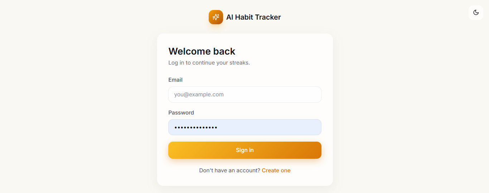
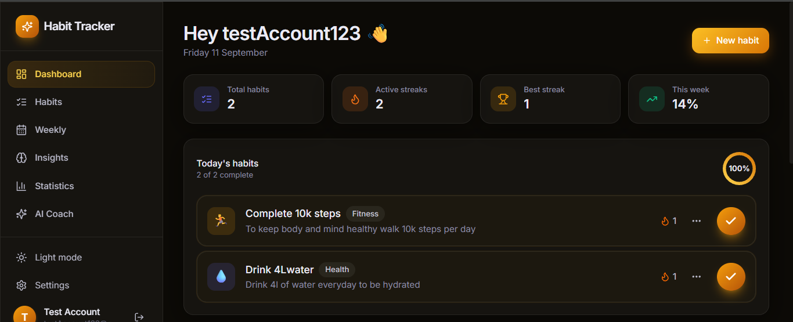
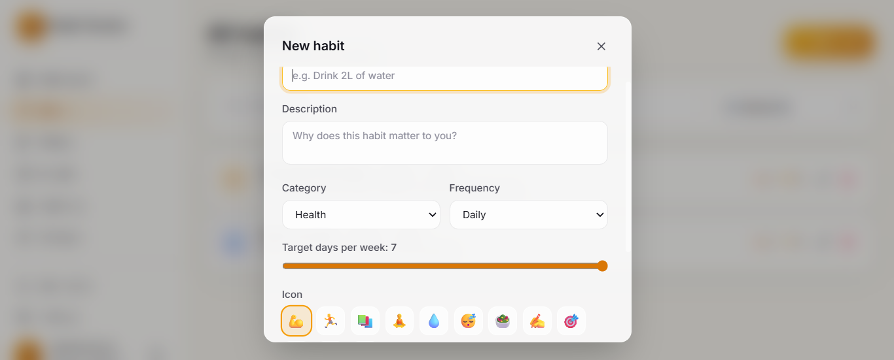
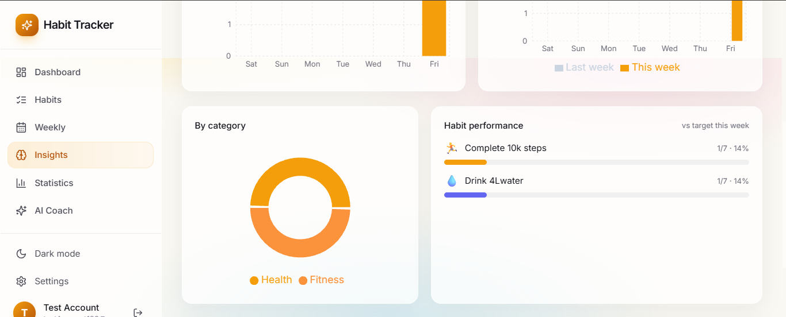
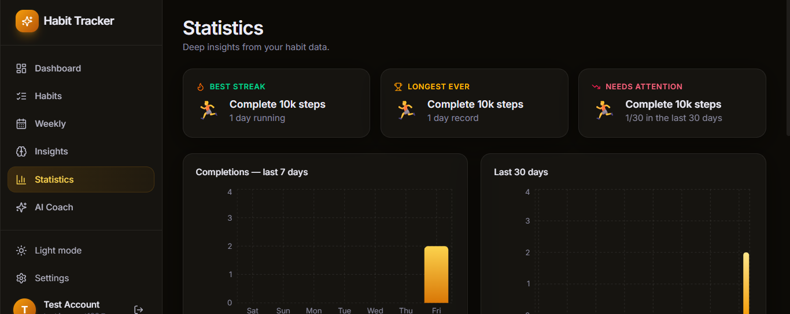
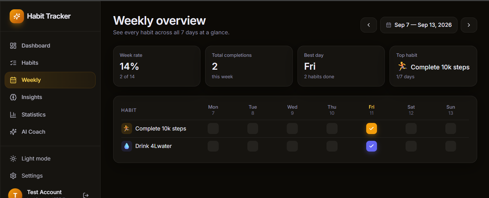
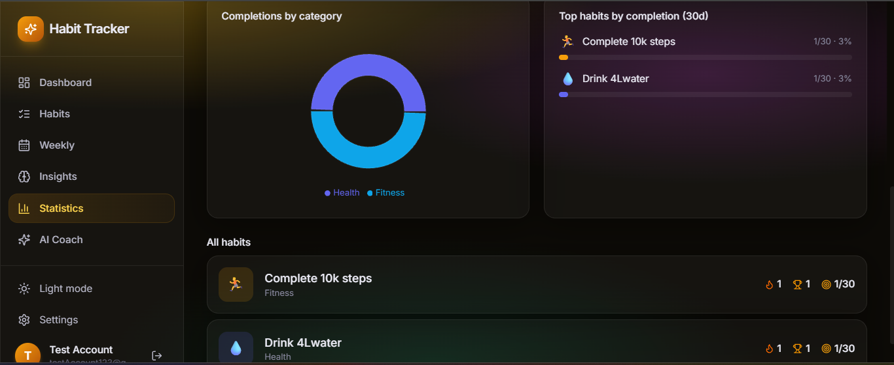

# Habit Tracker with Streaks

A full-stack habit tracking application that helps users build consistent routines, track daily progress, and maintain meaningful streaks based on their local calendar days.

**🌐 Live Demo:** https://habit-tracker-self-70fe.vercel.app

**📦 GitHub:** https://github.com/mansi0sinha/Habit-Tracker

---

## ✨ Overview

Habit Tracker with Streaks is a full-stack web application designed to make habit building simple, measurable, and consistent.

Users can create and manage habits, check in for specific days, track current and longest streaks, analyze their progress through statistics and visualizations, and receive personalized guidance from an AI habit coach.

A key part of the application is its **timezone-aware streak system**. Each user selects an IANA timezone during registration, allowing check-ins and streak calculations to follow the user's actual local calendar rather than relying solely on UTC dates.

The application is built with a React frontend, Node.js/Express backend, MongoDB database, JWT authentication, and Google Gemini integration.

---

## 🖥️ Application screenshots

### 🏠 Landing Page


### 🔐 Login Page



### 📊 Dashboard



### ➕ Create Habit



### 📈 Insights



### 📊 Statistics



### 📅 Weekly Progress



### 📉 Habit Statistics



---

## 🚀 Features

### 🔐 User Authentication

* User registration and login
* JWT-based authentication
* Protected API routes
* User-specific habit data
* IANA timezone selection during registration
* Secure password hashing
* Profile name update

### 📝 Habit Management

* Create new habits
* Edit existing habits
* Delete habits
* Add habit descriptions
* Organize habits by category
* Choose custom icons
* Choose custom colors
* Daily or weekly frequency
* Configure target days per week
* Search habits
* Filter habits by category

### ✅ Smart Check-ins

* Check in for the current day
* Backfill previous days
* Prevent duplicate check-ins for the same habit and local date
* Prevent check-ins for future local dates
* Prevent check-ins before a habit was created
* Ensure users can only check in their own habits

### 🔥 Streak Tracking

* Current streak tracking
* Longest streak tracking
* Calendar-based streak calculation
* Timezone-aware streak calculation
* Current streak requires today's completion
* Prevents timezone differences from incorrectly breaking streaks

### 📊 Progress & Analytics

* Dashboard progress overview
* Weekly habit tracking
* Monthly statistics
* Weekly statistics
* Habit completion analysis
* Category-based analytics
* Progress charts
* Heatmap-style activity visualization
* Weekly and monthly progress visualizations

### 🤖 AI Habit Coach

* Personalized habit coaching using Google Gemini
* AI-generated guidance based on habit information and progress
* Dedicated AI Coach interface
* Authenticated AI requests

### 🎨 Modern User Interface

* Responsive desktop and mobile design
* Light and dark themes
* Reusable React components
* Interactive habit cards
* Progress indicators
* Charts and visualizations
* Mobile navigation
* Loading states
* Confirmation modals
* Clean and modern dashboard experience

---

## 🛠️ Tech Stack

### Frontend

* **React.js** — Component-based UI development
* **Vite** — Frontend development and build tooling
* **Tailwind CSS** — Responsive styling and UI design
* **Axios** — HTTP client for communicating with the backend API
* **React Router** — Client-side routing
* **Lucide React** — UI icons
* **Recharts** — Data visualization
* **date-fns** — Date manipulation and formatting

### Backend

* **Node.js** — JavaScript runtime
* **Express.js** — REST API framework
* **MongoDB** — NoSQL database
* **Mongoose** — MongoDB object modeling
* **JWT** — Authentication and authorization
* **bcrypt** — Password hashing
* **Zod** — Request validation
* **Luxon** — Timezone-aware date handling

### AI

* **Google Gemini API** — AI-powered habit coaching

### Deployment

* **Vercel** — Frontend deployment
* **Render** — Backend deployment
* **MongoDB Atlas** — Cloud database hosting

### Development Tools

* **Git & GitHub** — Version control and source code hosting
* **Postman** — API testing and backend development

---

## 🏗️ Architecture

The application follows a full-stack client-server architecture.

```text
                    ┌─────────────────────────┐
                    │       React + Vite      │
                    │        Frontend         │
                    │        (Vercel)         │
                    └────────────┬────────────┘
                                 │
                                 │ REST API
                                 │ Axios
                                 ▼
                    ┌─────────────────────────┐
                    │     Node.js + Express   │
                    │        Backend          │
                    │        (Render)          │
                    └────────────┬────────────┘
                                 │
                         Mongoose ODM
                                 │
                                 ▼
                    ┌─────────────────────────┐
                    │      MongoDB Atlas      │
                    │        Database         │
                    └─────────────────────────┘

                                 │
                                 │ AI Requests
                                 ▼
                    ┌─────────────────────────┐
                    │     Google Gemini       │
                    │      AI Coach           │
                    └─────────────────────────┘
```

### Application Flow

1. The user interacts with the React frontend.
2. Axios sends requests to the Express REST API.
3. JWT authentication middleware verifies protected requests.
4. Request data is validated using the application's validation layer.
5. Express controllers process the application logic.
6. Mongoose communicates with MongoDB Atlas.
7. The backend returns the requested data to the frontend.
8. React updates the dashboard, habits, streaks, statistics, and visualizations.
9. AI Coach requests are sent to Google Gemini and the generated guidance is returned to the user.

---

## 🔐 Authentication Flow

```text
User
 │
 ▼
Register / Login
 │
 ▼
Express API
 │
 ├── Password hashing / verification
 │
 └── JWT generation
          │
          ▼
     Authentication Token
          │
          ▼
     React localStorage
          │
          ▼
Authenticated API Requests
          │
          ▼
JWT Middleware
          │
          ▼
Protected Resources
```

JWT middleware protects authenticated resources and ensures users can only access their own data.

---

## 📅 Date & Streak Logic

One of the most important engineering decisions in the application is treating streaks as **calendar-day based rather than elapsed-hour based**.

Each user has an IANA timezone, for example:

```text
Asia/Kolkata
```

A check-in stores two important values:

```text
checkedAt  → actual UTC timestamp
localDate  → local calendar date the check-in counts toward
```

For example, a user may check in late at night according to UTC but still be on the previous calendar day in their local timezone.

By storing both the UTC timestamp and the local date, the application can determine exactly which local calendar day the check-in belongs to.

This prevents timezone differences from incorrectly breaking or extending a user's streak.

### Streak Rules

* A habit can have only one check-in for a particular local date.
* Future local dates are rejected.
* Dates before the habit was created are rejected.
* The current streak is based on consecutive local calendar days.
* The current streak includes today, meaning that if today's habit has not been completed, the current streak becomes `0`.
* The longest streak is calculated independently from the current streak.

---

## 📁 Project Structure

```text
Habit-Tracker/
│
├── frontend/
│   ├── public/
│   │
│   ├── src/
│   │   ├── api/
│   │   │   └── axios.js
│   │   │
│   │   ├── assets/
│   │   │   ├── hero.png
│   │   │   ├── react.svg
│   │   │   └── vite.svg
│   │   │
│   │   ├── components/
│   │   │   ├── AIChat.jsx
│   │   │   ├── AIWeeklyReport.jsx
│   │   │   ├── CategoryPieChart.jsx
│   │   │   ├── HabitForm.jsx
│   │   │   ├── HabitStatsCard.jsx
│   │   │   ├── HeatmapChart.jsx
│   │   │   ├── LoadingSpinner.jsx
│   │   │   ├── Markdown.jsx
│   │   │   ├── MobileNav.jsx
│   │   │   ├── Modal.jsx
│   │   │   ├── MonthlyBarChart.jsx
│   │   │   ├── OrbitingHabits.jsx
│   │   │   ├── ProgressRing.jsx
│   │   │   ├── ProtectedRoute.jsx
│   │   │   ├── Sidebar.jsx
│   │   │   ├── SummaryCards.jsx
│   │   │   ├── TodayHabitCard.jsx
│   │   │   ├── WeeklyBarChart.jsx
│   │   │   └── WeeklyGrid.jsx
│   │   │
│   │   ├── context/
│   │   │   ├── AuthContext.jsx
│   │   │   └── ThemeContext.jsx
│   │   │
│   │   ├── pages/
│   │   │   ├── AICoach.jsx
│   │   │   ├── Dashboard.jsx
│   │   │   ├── Habits.jsx
│   │   │   ├── Insights.jsx
│   │   │   ├── Landing.jsx
│   │   │   ├── Login.jsx
│   │   │   ├── Register.jsx
│   │   │   ├── Stats.jsx
│   │   │   └── Weekly.jsx
│   │   │
│   │   ├── utils/
│   │   │   ├── constants.js
│   │   │   ├── confetti.js
│   │   │   └── dateHelpers.js
│   │   │
│   │   ├── App.jsx
│   │   ├── index.css
│   │   └── main.jsx
│   │
│   ├── package.json
│   └── vercel.json
│
├── backend/
│   ├── src/
│   │   ├── config/
│   │   │   └── db.js
│   │   │
│   │   ├── controllers/
│   │   │   ├── ai.controller.js
│   │   │   ├── auth.controller.js
│   │   │   └── habit.controller.js
│   │   │
│   │   ├── middleware/
│   │   │   └── auth.middleware.js
│   │   │
│   │   ├── models/
│   │   │   ├── CheckIn.js
│   │   │   ├── Habit.js
│   │   │   └── User.js
│   │   │
│   │   ├── routes/
│   │   │   ├── ai.routes.js
│   │   │   ├── auth.routes.js
│   │   │   └── habit.routes.js
│   │   │
│   │   ├── validators/
│   │   │   ├── auth.validator.js
│   │   │   └── habit.validator.js
│   │   │
│   │   ├── app.js
│   │   ├── gemini.js
│   │   └── server.js
│   │
│   ├── tests/
│   ├── package.json
│   └── .env
│
├── .gitignore
└── README.md
```

### Backend Organization

The backend follows a modular route-controller-model architecture:

* **Routes** — Define API endpoints.
* **Controllers** — Handle application logic and responses.
* **Models** — Define MongoDB schemas using Mongoose.
* **Middleware** — Handles authentication and request protection.
* **Validators** — Validate incoming request data.
* **Config** — Handles database configuration and connection.
* **Gemini integration** — Provides access to the AI service.

### Frontend Organization

The frontend is separated into:

* **Pages** — Main application screens.
* **Components** — Reusable UI components.
* **Context** — Global authentication and theme state.
* **API** — Centralized Axios configuration.
* **Utils** — Shared constants and helper functions.

---

## 🔌 API Overview

The backend exposes RESTful API endpoints for authentication, habits, check-ins, statistics, and AI coaching.

### Authentication

```text
POST   /api/auth/register
POST   /api/auth/login
PUT    /api/auth/profile
```

### Habits

```text
GET    /api/habits
POST   /api/habits
PUT    /api/habits/:id
DELETE /api/habits/:id
```

The habit API handles creation, retrieval, updating, and deletion of user-owned habits.

### Habit Statistics & Check-ins

The habit API also provides functionality for:

* Recording check-ins
* Retrieving check-in history
* Calculating current streaks
* Calculating longest streaks
* Retrieving habit statistics

### AI Coach

```text
POST   /api/ai/coach
```

The AI Coach endpoint is protected by authentication and uses Google Gemini to generate personalized habit guidance.

### Health Check

```text
GET    /api/health
```

Returns a simple response confirming that the backend API is running.

---

## 🗄️ Database Design

The application uses MongoDB with three primary models.

### User

```text
User
├── email
├── password
├── timezone
└── name
```

Each user stores their IANA timezone so that habit dates and streaks can be calculated correctly.

### Habit

```text
Habit
├── name
├── description
├── category
├── frequency
├── targetDays
├── color
├── icon
├── owner
├── createdAt
└── updatedAt
```

Each habit belongs to a specific user through the `owner` reference.

### CheckIn

```text
CheckIn
├── habit
├── localDate
└── checkedAt
```

A compound unique index on:

```text
habit + localDate
```

ensures that a habit cannot have multiple check-ins for the same local calendar day.

---

## ⚙️ Local Development

### Prerequisites

Make sure you have installed:

* Node.js
* npm
* MongoDB Atlas account or a MongoDB instance
* Git

### 1. Clone the repository

```bash
git clone https://github.com/mansi0sinha/Habit-Tracker.git
cd Habit-Tracker
```

### 2. Install frontend dependencies

```bash
cd frontend
npm install
```

### 3. Install backend dependencies

Open another terminal:

```bash
cd backend
npm install
```

### 4. Configure environment variables

Create a `.env` file inside the `backend` directory:

```env
PORT=3000
CLIENT_URL=http://localhost:5173
MONGODB_URI=your_mongodb_connection_string
JWT_SECRET=your_jwt_secret
GEMINI_API_KEY=your_gemini_api_key
```

Create a `.env` file inside the `frontend` directory:

```env
VITE_API_URL=http://localhost:3000/api
```

**Never commit your `.env` files or API keys to GitHub.**

### 5. Start the backend

Inside `backend`:

```bash
npm run dev
```

The backend will run locally on:

```text
http://localhost:3000
```

### 6. Start the frontend

Inside `frontend`:

```bash
npm run dev
```

The frontend will run locally on:

```text
http://localhost:5173
```

---

## 🚀 Deployment

The application is deployed using separate frontend and backend services.

### Frontend

The React/Vite frontend is deployed on **Vercel**.

```text
GitHub
   │
   ▼
Vercel
   │
   ▼
React + Vite Application
```

### Backend

The Node.js/Express backend is deployed on **Render**.

```text
GitHub
   │
   ▼
Render
   │
   ▼
Express REST API
```

### Database

MongoDB Atlas provides the cloud database used by the backend.

```text
Render Backend
      │
      ▼
MongoDB Atlas
```

### Continuous Deployment

Both deployment services are connected to the GitHub repository.

Pushing changes to the `main` branch automatically triggers the appropriate deployment.

---

## 🧠 Key Engineering Decisions

### Timezone-Aware Dates

Instead of relying only on UTC timestamps, the application stores the local calendar date associated with each check-in.

This is important for habit tracking because users think in terms of:

```text
"Did I complete this habit today?"
```

rather than:

```text
"Has 24 hours passed since my previous check-in?"
```

### Unique Check-ins

A compound database index ensures that only one check-in can exist for a habit on a particular local date.

```text
(habit, localDate) → unique
```

This provides database-level protection against duplicate daily check-ins.

### Protected User Data

JWT authentication is used to protect API routes, while backend ownership checks ensure that users cannot modify or access habits belonging to another user.

### Centralized API Configuration

Axios is configured in a centralized API module so authentication tokens can automatically be attached to requests and unauthorized responses can be handled consistently.

### Client-Side Route Handling

The frontend uses React Router for application navigation. Vercel rewrite configuration ensures that routes such as `/dashboard`, `/habits`, and `/stats` work correctly even when accessed directly.

---

## 🧪 Testing & Development

Postman was used during development to test backend API endpoints and verify:

* Authentication
* Habit creation
* Habit updates
* Habit deletion
* Check-ins
* Statistics
* Protected routes
* AI Coach requests

The backend also includes a test structure for automated testing with Vitest and Supertest.

---

## 🔒 Security Considerations

* Passwords are hashed before being stored.
* JWT authentication protects private API routes.
* Habit ownership is verified on the backend.
* Duplicate check-ins are prevented at the database level.
* Future and invalid historical check-ins are rejected.
* Environment variables are used for secrets and database credentials.
* API keys are not intended to be committed to source control.

---

## 📈 What I Learned

Building this project involved working across the complete full-stack development workflow:

* Designing REST APIs with Express
* Connecting Node.js applications to MongoDB
* Designing Mongoose schemas and relationships
* Implementing JWT authentication
* Password hashing
* Request validation
* React component architecture
* Global state management with Context API
* Client-side routing
* API integration with Axios
* Timezone-aware date handling
* Streak calculation logic
* Data visualization
* AI API integration
* Responsive UI development
* Git and GitHub workflows
* Production deployment with Vercel and Render
* Connecting a deployed frontend with a deployed backend
* Debugging production issues such as CORS and client-side routing

---

## 🔮 Future Improvements

Possible future improvements include:

* Push notifications and reminders
* More advanced habit scheduling
* Calendar-based habit planning
* More detailed progress reports
* Additional personalization options
* Automated testing coverage expansion
* Performance optimizations
* Offline support

---

## 🌐 Live Application

Try the deployed application:

[**https://habit-tracker-self-70fe.vercel.app**](https://habit-tracker-self-70fe.vercel.app)

---

## 👨‍💻 Author

**Mansi Sinha**

GitHub: https://github.com/mansi0sinha/Habit-Tracker

---

## ⭐ Support

If you found this project interesting, consider giving the repository a ⭐ on GitHub.
